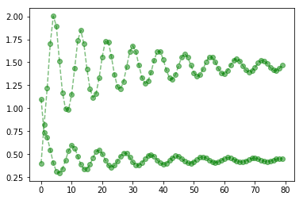
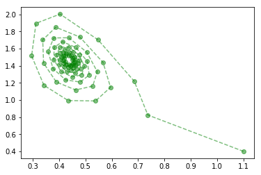
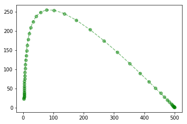
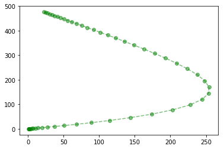
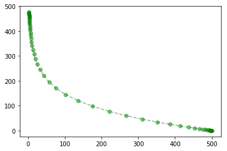

# Discrete Time Models in Python
#### Version 0.1


## A system of two equations - predator and prey

Given two species p and q, as predator and prey respectively, the function

```python
def predator_prey(K, r, s, u, v, p, q): return([p * (1 + r * (1 - p / K)) - s * p * q, (1 - u) * q + v * p * q])
```
may be used to generate a sequence of values representing the interaction of the populations over time.

A class for a two-equation system is given by the following

```python
class FDM2:
    
    def __init__(self, x0, y0, func, *variables):
        
        self.x, self.y, self.func, *self.variables = x0, y0, func, *variables
        
    def update(self):
        self.x, self.y = self.func(*self.variables, self.x, self.y)
        
    def generate(self, n, *arguments):
        
        sequence = []
        
        for i in range(n):
            sequence.append([self.x, self.y])
            self.update()
        if ("plot" in arguments):
            fig, ax, = plt.subplots()
            ax.plot(range(n), sequence, 'go--', alpha = 0.5)
            plt.show()
            
        sequence = np.array(sequence)
        if ("phase" in arguments):
            xp = sequence[0:len(sequence), 0:1]
            yp = sequence[0:len(sequence), 1:2]
            plt.plot(xp, yp, 'go--', alpha = 0.5)
            plt.show()
        
        return(sequence)
```

Given the starting conditions `p = 1.1`, `q = 0.4`, and the parameters `K = 1`, `r = 1.3`, `s = 0.5`, `u = 0.7`, and `v = 1.6`, create an instance of the two-system class passing the predator-prey model as a function along with the initial values and the parameters. The options "plot" and "phase" are selected, in order to plot the change in time of the populations and the phase plot, respectively. This yields the following two plots

```python
pred_prey = FDM2(1.1, 0.4, predator_prey, 1, 1.3, 0.5, 0.7, 1.6)
pred_prey.generate(80, "plot", "phase")
```








## A system of three equations - SIR model of infectious disease
The SIR model of infectious disease is named for its three key components: **S**usceptible, **I**nfected, and **R**ecovered. These refer to three components of the population that change over time.

The SIR model uses three different equations, one for each component of the population. These can be defined by the function

```python
def sir(alpha, gamma, s, i, r): return([s - alpha*s*i, i + alpha*s*i - gamma*i, r + gamma*i])
```

A class for a system of three equations is defined below, much as before with the two-system class

```python
class FDM3:
    
    def __init__(self, x0, y0, z0, func, *variables):
        
        self.x, self.y, self.z, self.func, *self.variables = x0, y0, z0, func, *variables
        self.x2, self.y2, self.z2, self.func2, *self.variables2 = x0, y0, z0, func, *variables
            
    def update(self):
        self.x, self.y, self.z = self.func(*self.variables, self.x, self.y, self.z)
        self.x2, self.y2, self.z2 = self.func(*self.variables, self.x2, self.y2, self.z2)
        
    def generate(self, n, *arguments):
        
        sequence = []
        
        for cnt in range(n):
            sequence.append([self.x, self.y, self.z])
            self.update()
        if ("plot" in arguments):
            fig, ax, = plt.subplots()
            ax.plot(range(n), sequence, 'go--', alpha = 0.5)
            plt.show()
            
        sequence = np.array(sequence)
        
        if ("phase" in arguments):
            xp = sequence[0:len(sequence), 0:1]
            yp = sequence[0:len(sequence), 1:2]
            zp = sequence[0:len(sequence), 2:3]
            plt.plot(xp, yp, 'go--', alpha = 0.5)
            plt.show()
            plt.plot(yp, zp, 'go--', alpha = 0.5)
            plt.show()
            plt.plot(xp, zp, 'go--', alpha = 0.5)
            plt.show()
            
        return(sequence)
```

An instance of the three-system class is created below along with the relevant plots.

```python
fdm3 = FDM3(500, 1, 0, sir, 0.001, 0.1)
fdm3.generate(50, "phase")
```











