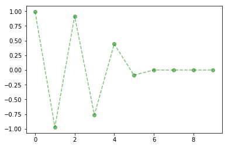

# PyFDM
#### Version 0.2

### An example function

```python
def f(x):
    return(-1*x**3)
```

### Example of information provided using the equation's class
```python
my_findiff = Fin_diff(f)
print(my_findiff.generate(10, 0.99))
print(my_findiff.find_equilibrium())
my_findiff.plot()
```

    [0.99, -0.970299, 0.9135172474836409, -0.7623427143471039, 0.44304798162617304, -0.0869665590982472, 0.0006577439492812129, -2.845578591723159e-10, 2.3041553390057966e-29, -1.2233064442983122e-86]
    [array([ 0.,  0.]), array([ 0.,  0.])]



